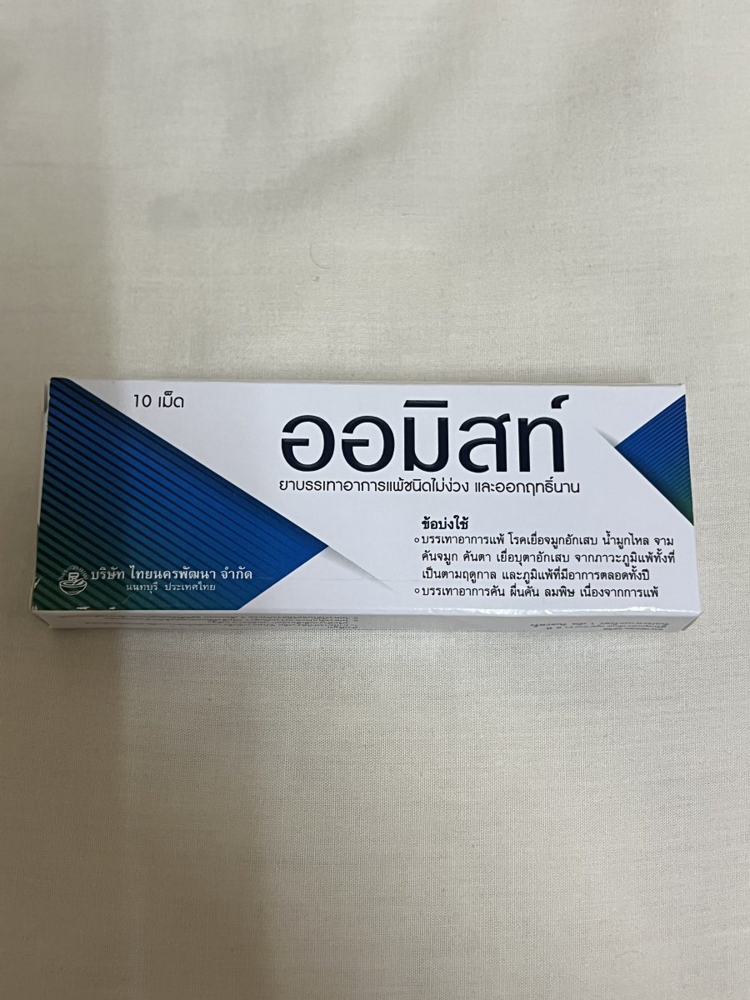
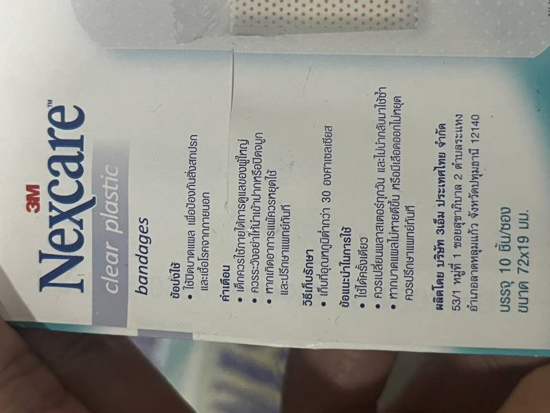
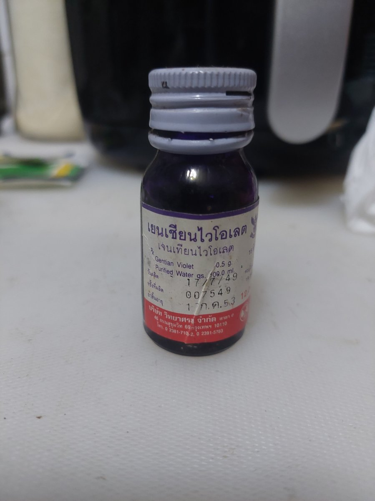
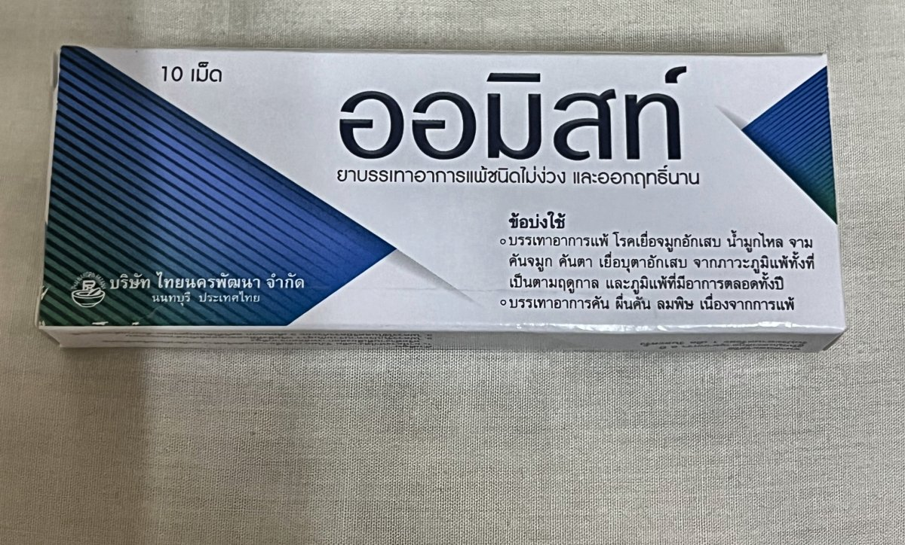

# medicine-image-preprocessing

A standalone image-preprocessing package for phone-camera images of medicine labels, cartons, and bottles. It can crop the detected foreground, correct minor tilt, normalize lighting and color, reduce noise, sharpen slightly soft images, and resize them for downstream processing. It returns a processed image and detailed operation metadata. It does not perform object detection, OCR, or text interpretation.

## Installation

```powershell
python -m venv .venv
.venv\Scripts\python.exe -m pip install -e ".[dev]"
```

Requires Python 3.10.

## Quick start

```python
from medicine_preprocess import PreprocessConfig, preprocess_image

result = preprocess_image("medicine.jpg", PreprocessConfig.grabcut_experimental(), source_id="medicine-001")
processed_bgr = result.image
print(result.operations)
```

### Notes

- `grabcut_experimental()` is the only configuration this package ships and the default when `config` is omitted.
- NumPy array inputs are assumed to be BGR by default. Set `InputConfig.array_color_order` when providing RGB or another supported color order.

## Pipeline

1. Decode and canonicalize (EXIF orientation, BGR uint8)
2. Crop (foreground detection)
3. Deskew (small-angle correction)
4. Pre-enhancement resize (downscale cap)
5. Quality assessment
6. White balance
7. Exposure correction
8. Contrast correction
9. Denoise
10. Sharpen
11. Resize (final)
12. Validation

Each stage after decoding is independently skippable; stages 6-10 are individually gated by the quality assessment in step 5, not applied unconditionally.

## What it can apply

Each correction below is quality-gated: applied only when a measurement of the image indicates it is needed, not unconditionally.

- Foreground crop via classical segmentation (no trained model), 448 px working resolution, full-resolution output. 2.5 s hard timeout; uncropped fallback instead of a guessed center-crop.
- Small-angle deskew up to ±10°, validated before being kept.
- White balance (gray-world, per-channel gain clamped to 0.8-1.25) and gamma brightening only (never darkening), in the range 1.0-1.55.
- CLAHE local contrast correction, clip limit 1.4.
- Denoise, selected automatically between median (impulse noise) and bilateral (general noise).
- Unsharp-mask sharpening (sigma 1.0, amount 0.35, threshold 3) for slightly soft images.
- Resize: pre-enhancement downscale to a 2048 px long side, final upscale below a 960 px short side (max 2x).

## Examples

Unmodified `result.image` output at default settings. Each pair is the direct input and the direct output; no other processing.

| | Label | Flat carton | Bottle |
| --- | --- | --- | --- |
| Input |  |  |  |
| Output |  |  |  |

## Output

`PreprocessResult.image` is a non-empty, contiguous, 8-bit BGR NumPy array. The result also includes:

- `operations`: ordered per-stage records (name, status, reason, details, duration).
- `original_to_final_transform` / `final_to_original_transform`: mutually inverse coordinate transforms.
- `crop`, `resize_scale_factor`, `resize_scale_x`, `resize_scale_y`: geometry metadata.
- `quality_before` / `quality_after`: quality measurements before and after processing.
- `warnings`, `fallback_used`: whether any stage was reverted or failed safely.
- `config_json`, `config_hash`, `input_hash`, `canonical_image_hash`, `output_image_hash`, `runtime_environment`: provenance and reproducibility metadata.

## Performance

Measured on a 163-image dataset:

| Stage | p50 | p90 | max |
| --- | --- | --- | --- |
| Full pipeline | 1060 ms | 1817 ms | 3852 ms |
| Crop stage | 530 ms | 1163 ms | 2539 ms |

Crop timeout rate: 1.2% (2/163). Crop applied confidently on 156/163 images (96%); the remaining 7 fell back to the uncropped image (2 timeout, 5 low-confidence rejection).

## Limitations

- No object detection.
- No semantic label localization (text, logo, or barcode identification).
- No automatic 90-degree-multiple orientation correction.
- No perspective correction in this configuration.
- No curved or cylindrical label unwrapping.
- No OCR accuracy evaluation.

## Windows multiprocessing note

Crop detection runs in a separate process. On Windows, guard your entry point with `if __name__ == "__main__":`. Without it, the failure is silent: crop always times out and returns the uncropped image rather than raising an error.

## Tests

Automated tests in `tests/unit` and `tests/system`.

```powershell
.venv\Scripts\python.exe -m pytest
```
