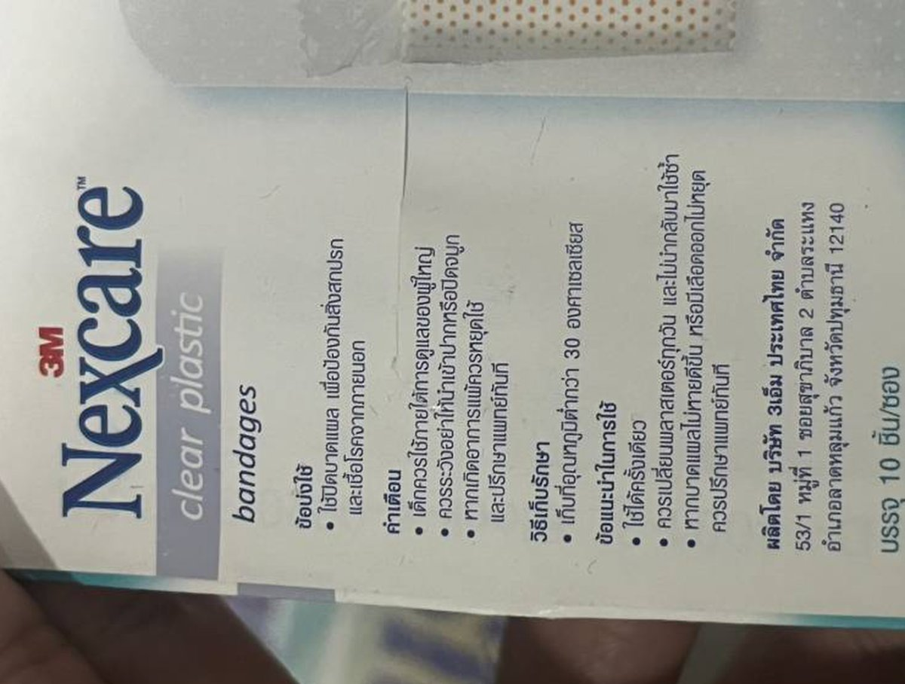
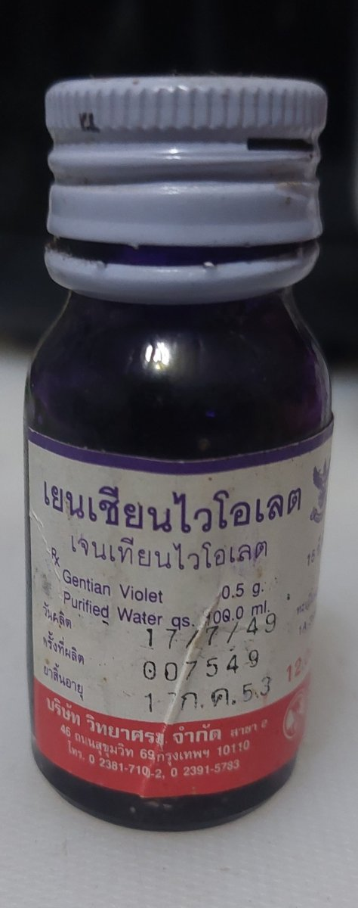
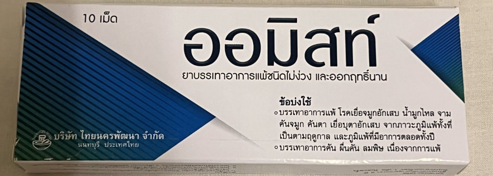
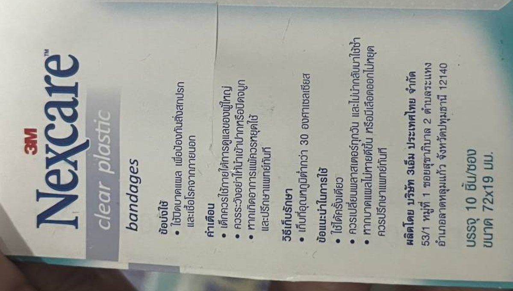
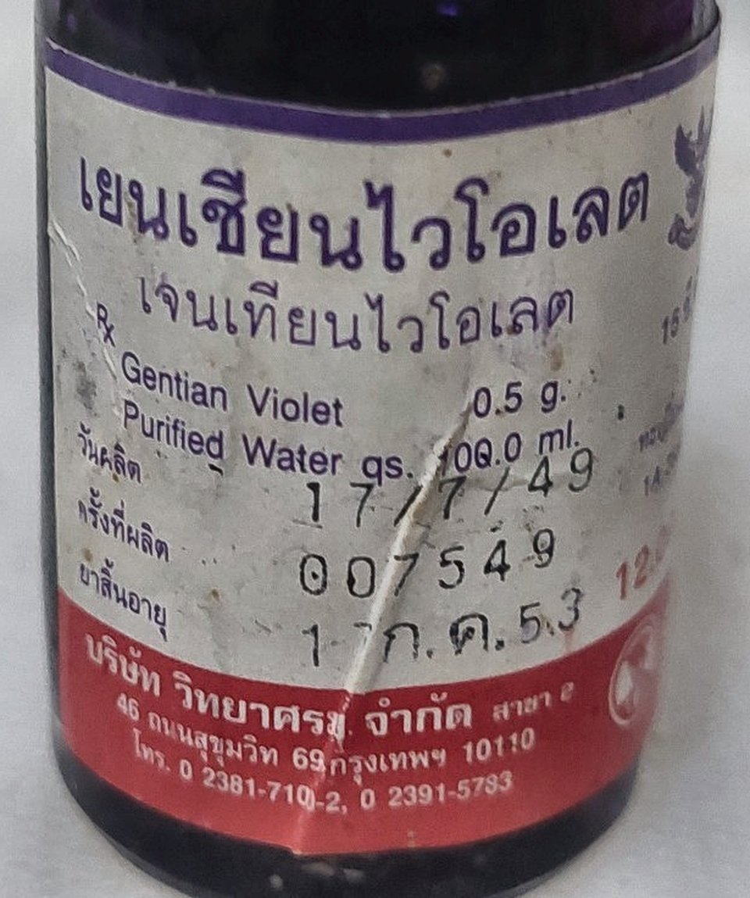

# medicine-image-preprocessing

A standalone image-preprocessing package for phone-camera images of medicine labels, cartons, and bottles. It crops to the label region, corrects minor tilt, normalizes lighting and color, reduces noise, sharpens slightly soft images, and resizes for downstream processing. It returns a processed image and detailed operation metadata. It does not perform OCR or text interpretation.

Two crop mechanisms: `grabcut()` (default, no trained model) or `yolo_label_crop_experimental()` (trained label detector, requires the `yolo` extra, weights included). Everything after crop is identical either way.

## Installation

```powershell
python -m venv .venv
.venv\Scripts\python.exe -m pip install -e ".[dev]"
```

Requires Python 3.10.

## Quick start

```python
from medicine_preprocess import PreprocessConfig, preprocess_image

result = preprocess_image("medicine.jpg", PreprocessConfig.grabcut(), source_id="medicine-001")
processed_bgr = result.image
print(result.operations)
```

### Notes

- `grabcut()` is the default when `config` is omitted.
- `yolo_label_crop_experimental()` is the alternative crop mechanism. Requires `pip install medicine_preprocess[yolo]`. Uses the bundled weights by default; pass `weights_path=...` to use your own.
- NumPy array inputs are assumed to be BGR by default. Set `InputConfig.array_color_order` when providing RGB or another supported color order.

## Pipeline

1. Decode and canonicalize (EXIF orientation, BGR uint8)
2. Crop (GrabCut foreground detection, or YOLO label detection)
3. Deskew (small-angle correction)
4. Pre-enhancement resize (downscale cap)
5. Quality assessment
6. White balance
7. Exposure correction
8. Contrast correction
9. Denoise
10. Sharpen
11. Resize (final)
12. Validation

Each stage after decoding is independently skippable; stages 6-10 are individually gated by the quality assessment in step 5, not applied unconditionally.

## What it can apply

Each correction below is quality-gated: applied only when a measurement of the image indicates it is needed, not unconditionally.

- Crop, GrabCut (default): classical foreground segmentation, no trained model, 448 px working resolution, full-resolution output, 2.5 s hard timeout, uncropped fallback.
- Crop, YOLO (experimental): trained label detector, confidence-tiered acceptance (>=0.5 direct, 0.25-0.5 with a geometry sanity check), multiple detections unioned into one box unless the union covers >=90% of the frame, 5%/6% padding, uncropped fallback on low confidence or a near-full-frame union.
- Small-angle deskew up to ±10°, validated before being kept.
- White balance (gray-world, per-channel gain clamped to 0.8-1.25) and gamma brightening only (never darkening), in the range 1.0-1.55.
- CLAHE local contrast correction, clip limit 1.4.
- Denoise, selected automatically between median (impulse noise) and bilateral (general noise).
- Unsharp-mask sharpening (sigma 1.0, amount 0.35, threshold 3) for slightly soft images.
- Resize: pre-enhancement downscale to a 2048 px long side, final upscale below a 960 px short side (max 2x).

## Examples

Unmodified `result.image` output, full pipeline, no other processing. Same 3 input photos through both crop mechanisms.

| | Label | Flat carton | Bottle |
| --- | --- | --- | --- |
| Input |  |  |  |
| Output, GrabCut |  |  |  |
| Output, YOLO |  |  |  |

## Output

`PreprocessResult.image` is a non-empty, contiguous, 8-bit BGR NumPy array. The result also includes:

- `operations`: ordered per-stage records (name, status, reason, details, duration).
- `original_to_final_transform` / `final_to_original_transform`: mutually inverse coordinate transforms.
- `crop`, `resize_scale_factor`, `resize_scale_x`, `resize_scale_y`: geometry metadata.
- `quality_before` / `quality_after`: quality measurements before and after processing.
- `warnings`, `fallback_used`: whether any stage was reverted or failed safely.
- `config_json`, `config_hash`, `input_hash`, `canonical_image_hash`, `output_image_hash`, `runtime_environment`: provenance and reproducibility metadata.

## Performance

Measured on the same 163-image dataset for both crop mechanisms:

| Stage | p50 | p90 | max |
| --- | --- | --- | --- |
| Full pipeline, GrabCut crop | 1060 ms | 1817 ms | 3852 ms |
| Full pipeline, YOLO crop | 391 ms | 1005 ms | 1328 ms |
| Crop stage, GrabCut | 530 ms | 1163 ms | 2539 ms |
| Crop stage, YOLO | 48 ms | 75 ms | 173 ms |

GrabCut: crop timeout rate 1.2% (2/163); applied confidently on 156/163 (96%), 7 fell back (2 timeout, 5 low-confidence rejection).
YOLO: applied on 161/163 (99%); 2 fell back to the uncropped image.

### Per-stage breakdown, GrabCut

| Stage | p50 | p90 | max |
| --- | --- | --- | --- |
| canonicalize (decode) | 39.0 ms | 269.2 ms | 336.5 ms |
| crop (GrabCut) | 529.6 ms | 1162.7 ms | 2538.5 ms |
| quality_before (capped preview) | 45.8 ms | 54.4 ms | 95.5 ms |
| deskew | 23.6 ms | 51.3 ms | 101.7 ms |
| pre_enhancement_resize | 1.7 ms | 13.7 ms | 45.6 ms |
| working_quality (post-geometry) | 75.0 ms | 179.3 ms | 250.2 ms |
| white_balance | 51.9 ms | 168.9 ms | 352.3 ms |
| sharpen | 0.0 ms | 189.1 ms | 491.2 ms |
| quality_after | 111.3 ms | 177.0 ms | 244.8 ms |
| clahe | 0.0 ms | 18.6 ms | 70.2 ms |
| resize (final) | 6.0 ms | 10.5 ms | 20.7 ms |

### Per-stage breakdown, YOLO

CPU inference, steady state (excludes one-time model-load cost on the first call).

| Stage | p50 | p90 | max |
| --- | --- | --- | --- |
| canonicalize (decode) | 36.2 ms | 260.8 ms | 300.2 ms |
| crop (YOLO) | 47.9 ms | 74.5 ms | 172.8 ms |
| deskew | 21.9 ms | 75.7 ms | 168.0 ms |
| pre_enhancement_resize | 1.0 ms | 29.3 ms | 56.5 ms |
| white_balance | 30.5 ms | 121.7 ms | 273.2 ms |
| clahe | 0.0 ms | 17.3 ms | 105.5 ms |
| sharpen | 0.0 ms | 0.0 ms | 396.7 ms |
| resize (final) | 20.2 ms | 31.2 ms | 54.5 ms |

## Limitations

- No sub-field localization (drug name, dose, logo, or barcode identification).
- No automatic 90-degree-multiple orientation correction.
- No perspective correction in this configuration.
- No curved or cylindrical label unwrapping.
- No OCR accuracy evaluation.

## Windows multiprocessing note

GrabCut crop detection runs in a separate process. On Windows, guard your entry point with `if __name__ == "__main__":`. Without it, the failure is silent: crop always times out and returns the uncropped image rather than raising an error. YOLO crop runs synchronously in-process and isn't affected by this.

## Tests

Automated tests in `tests/unit` and `tests/system`.

```powershell
.venv\Scripts\python.exe -m pytest
```
